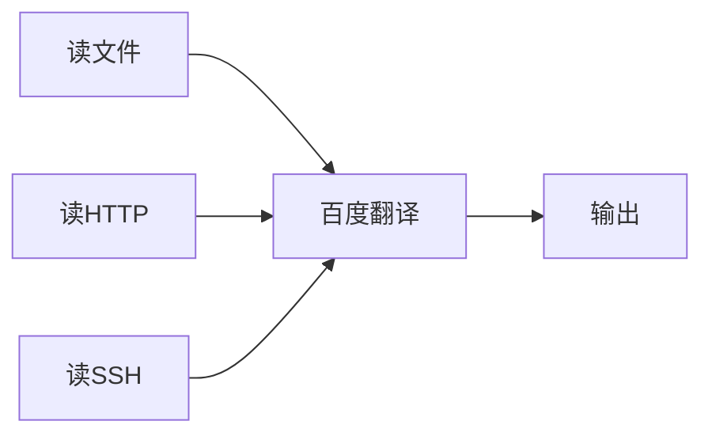
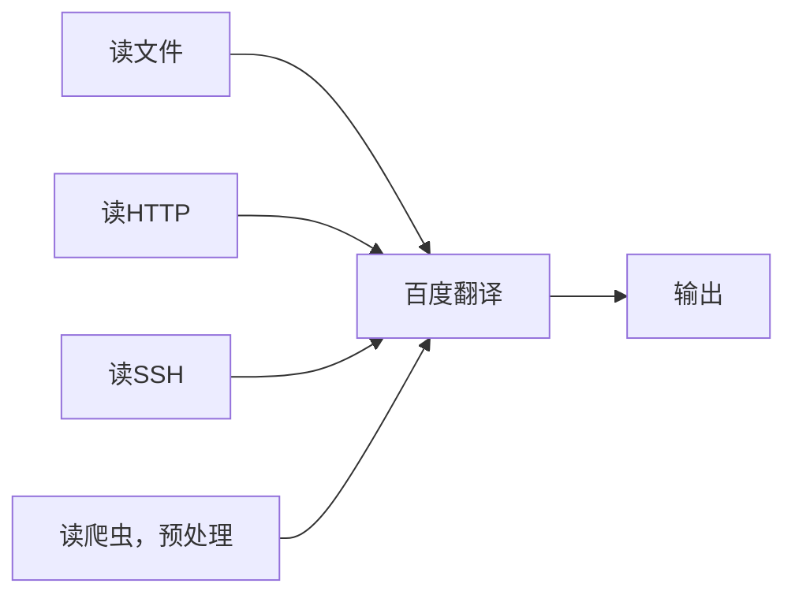
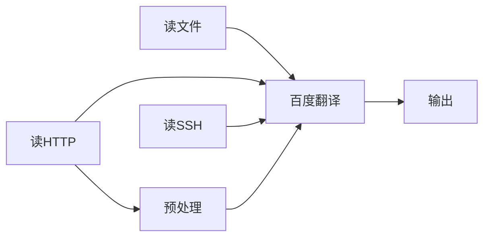

## 前言

某种意义上说，`C`在语言层面支持的抽象能力非常有限，我们都对`C++`或者`Python`中利用面向对象的方式组织和抽象代码的方式印象深刻，但一旦谈论到`C`语言，大家往往都只会认为它粗糙、原始，但笔者看来，某些时候原始的`C`语言反而能带来更大的灵活性。

几个月前跟朋友说过关于`C`的抽象问题，我们最后达成的共识之一是，`C`能够模拟几乎所有的编程范式，但它无法完美兼容这些范式，它总是缺少诸如继承类型检查、生命周期钩子等等**锦上添花**的特性。

这篇文章从简单抽象方法入手，讨论一下对于`C`语言来说，可用的抽象手段有哪些。

## 首先，为什么抽象？

抽象是一种很常见的代码工程技巧，其最根本的目的就是**代码复用**，什么是代码复用？假设我们正在编写一个程序，它的功能是从不同的源中读取内容并翻译为中文，我们可以用流程图表示如下：


这段流程图表示从文件读取内容，利用百度翻译翻译为中文，最后输出。

现在，我们需要新增从`HTTP`接口和远程`SSH`读取内容的功能，我们只需要将流程图修改为：



这时候我们其实就已经进行了基本的代码复用，我们并没有写三遍百度翻译，而是为百度翻译设计了一个接口，让不同的读取器都使用这个接口。

现在，我们需要一个从特殊网站爬取内容，并按特定方式处理后再翻译的功能，我们就需要再新增一个流程：



我们很快就会发现，读爬虫最开始同样是`HTTP`请求，我们完全可以复用`HTTP`请求的代码，只需要在`HTTP`请求后增加一个预处理步骤即可，我们只需要修改流程图：



这就是最基本的代码复用，我们的目的是尽可能减少代码重复，从而提高代码的可维护性，而抽象就是其最重要的手段之一。根据笔者的经验，你所需要知道的全部抽象技巧，都可以归结为一句话——**依赖接口，而不是实现**。

## 如何抽象？

抽象手段是一个**因地制宜**的问题，不同的语言，不同的场景，抽象的手段往往不同，如果我们只讨论`C`语言的话，我们浅谈以下几种方法：

1. **函数指针**：通过留下全局或者局部函数指针，让用户动态替换这些函数来达到动态抽象的目的，这种方法最为原始，但是是其它动态抽象的基础：

   ```c
   // 需要多态的模块
   struct TextReader
   {
     size_t (*read)(struct TextReader* self, const char* src, char* buf, size_t len);
   };

   // 定义多种实现
   size_t 
   local_read(struct TextReader* self, const char* src, char* buf, size_t len)
   {
     // ...
   }

   size_t
   http_read(struct TextReader* self, const char* src, char* buf, size_t len)
   {
     // ...
   }

   // 使用时，通过函数指针来动态替换实现
   int 
   main() 
   {
     char buf[1024] = {0};

     struct TextReader rd;
     rd.read = http_read;

     rd.read(&rd, "http://example.com", buf, sizeof(buf));
   }
   ```

2. **选择编译和弱引用**：通过编译期宏选择编译实现或者通过`GNU`扩展的`__attribute__((weak))`来覆盖默认实现，因为这两者的手段类似，我们放在一起讨论：

   ```c
   // 用宏指定实现
   #ifdef USE_HTTP
   size_t
   read(const char* src, char* buf, size_t len)
   {
     // ...
   }
   #else
   size_t
   read(const char* src, char* buf, size_t len)
   {
     // ...
   }
   #endif
   ```


   ```c
   // 用弱引用指定默认实现
   size_t
   __attribute__((weak))
   read(const char* src, char* buf, size_t len)
   {
     // ...
   }

   // 使用时，如果弱引用被覆盖，则使用覆盖的实现
   int
   main()
   {
     char buf[1024] = {0};

     read("http://example.com", buf, sizeof(buf));
   }
   ```

3. **面向对象**：通过继承、多态等特性实现基于父子关系的抽象和复用，在`C`语言中较难实现。
4. **接口模式（组合模式）**：实际上是面向对象的弱化版本，但它强调纯虚父类，用一个只包含纯虚函数的父类来约束子类行为。
5. **概念concept**：概念是`C++`引入的概念，是一种元编程的约束手段，在`Rust`中也有相应的关键字，名为`trait`，它类似于接口模式，但实际上是函数式编程的副产品，有更强大的约束和复用能力。

前面的方法我们或多或少都有所了解，我们今天主要介绍的是`concept`，也就是`trait`。

## trait 简介

> 下面的介绍是对`Rust trait`的简介，详情请参考[Rust程序设计语言](https://kaisery.github.io/trpl-zh-cn/ch10-02-traits.html)。

`trait`某种意义上是对组合模式的延伸版本，它定义了一个类**能够做什么**或者**是什么**，比如我们接着上面的话题，从源读取内容可以被抽象为一个`Readable`或者`Reader`，它能够读取内容，那么我们就可以定义一个`trait`：

```rust
pub trait Readable {
    fn read(&self, src: &str) -> String;
}
```

这样，任何实现了`Readable`的类型都可以被当作`Reader`来使用，比如：

```rust
pub struct HttpReader;

impl Readable for HttpReader {
    fn read(&self, src: &str) -> String {
        // ...
    }
}
```
函数可以声明他们返回一个实现了`Readable`的类型，或者需要一个实现了`Readable`的类型作为参数，这被称为约束，比如：

```rust
fn get_reader() -> impl Readable {
    // ...
}

fn inspect_read(reader: &impl Readable) -> String {
    // ...
}
```

这样，我们就可以在函数中返回一个实现了`Readable`的类型，而不用关心它具体是什么，只需要知道它能够被读取即可。

一个`trait`的实现可以依赖其他的`trait`，我们可以参考`Rust`文档中的一段：

```rust
impl<T: Display> ToString for T {
    // --snip--
}
```

这段代码为任何实现了`Display`的类型实现了`ToString`，而`Display`是一个类型序列化的`trait`。

`trait`另一个特性是可以复合约束泛型，比如：

```rust
fn some_function<T, U>(t: &T, u: &U) -> i32
where
    T: Display + Clone,
    U: Clone + Debug,
{
  // ...
}
```

这个函数要求输入参数分别实现了`Display`和`Clone`，以及`Clone`和`Debug`，这种复合约束能进一步限制函数的输入和输出类型，从而提高函数的可用性。

我们可以总结出以下几个特性：

- 规定类的行为
- `trait`选择实现
- 对泛型的单约束/多约束

## 案例：Linux中的抽象

笔者实际上对`Linux`的了解并不深刻，不过对其中**代码复用**的方式略知一二，这里提及几个经典范例：

1. `VFS`：`VFS`是`Linux`虚拟文件系统，它将不同文件系统的实现抽象为一个统一的接口（函数指针），从而实现了抽象。

> 可以参考开源项目`fibdrv`中的[fibdrv.c](https://github.com/sysprog21/fibdrv/blob/master/fibdrv.c#L112)

2. `list_head`：`list_head`是一个链表节点，它将链表操作从真正的链表中抽离出来，通过`container_of`宏和实际链表元素之间相互转换，从而实现了链表操作的复用。

结合`VFS`（函数指针）和`list_head`的抽象方式，我们能够近似地在`C`中实现`trait`。

> `Linux`抽象的精妙之处就在于它在合适的地方选用了合适的抽象方式，达到了性能和代码可维护性的最佳平衡。

## 在 C 中实现 trait

为什么说`list_head`对`trait`的实现有启发式的帮助呢？如果我们不把它当作`list_head`，而当作`Iterable`，那么我们很快就能发现，`list_head`实际上是一个类似`trait`的抽象，而针对它的一系列方法，则相当于上文提到的`trait`约束。

但`list_head`只能启发针对约束的`trait`实现，而对于`trait`的规定类的行为，我们要借助`VFS`的启发，在构造`trait`派生结构体时，我们可以为`trait`结构体动态指定函数指针来达到统一接口，约束类行为的目的。

基于以上的思想，我们可以写出如下代码，仍然以`Reader`为例：

```c
struct Readable
{
  size_t (*read)(struct Readable* self, const char* src, char* buf, size_t len);
};
```

### trait

如果一个类要实现该`trait`，则只需要将该`trait`结构体嵌入到类中，并实现`read`函数即可：

```c
struct HttpReader
{
  struct Readable readable;
};

size_t
http_read(struct Readable* self, const char* src, char* buf, size_t len)
{
  // ...
}

void 
init_http_reader(struct HttpReader* reader)
{
  reader->readable.read = http_read;
}
```

### trait 约束

一个函数如果依赖`Readable`，则只需要声明该函数的参数为`struct Readable*`即可，而不用关心具体是什么类型，比如：

```c
size_t
do_read(struct Readable* reader)
{
  // 在这里尽情地使用 reader->read
}
```

同样，我们也可以为返回值添加约束，比如：

```c
struct Readable*
get_reader()
{
  // 通常是一个 Factory 函数，记得同时提供一个 destroy 函数
}
```

我们甚至可以为结构体添加约束，比如：

```c
struct Application
{
  struct Readable *reader;
  int some_magic_number;
};

void
run_app(struct Application* app)
{
  // 在这里尽情地使用 app->reader->read
}
```

### 多约束

我们可以引入一个中间结构体实现多约束，实际上，在多约束的场景中，我们只在乎返回或者接受的类型具体实现了哪几个`trait`，而不在乎具体是什么类型，因此我们可以提炼出一个只包含`trait`指针的结构体，比如：

> 假设我们现在已经实现了 `Writable` 和 `Readable` 两个 `trait`，分别代表可写和可读（只是举例子）

```c
struct ReadableAndWritable
{
  struct Readable* readable;
  struct Writable* writable;
};

void
do_read_write(struct ReadableAndWritable* rw)
{
  // 在这里，通过这个纯粹的`trait`结构体，我们就可以同时使用 readable 和 writable
}
```

接下来，我们实现一个`Port`：

```c
struct HttpPort
{
  struct Readable readable;
  struct Writable writable;
};

void
init_http_port(struct HttpPort* port)
{
  port->readable.read = http_read;
  port->writable.write = http_write;
}
```

如何将其传入`do_read_write`呢？我们只需要将`HttpPort`中的`readable`和`writable`提取出来即可：

```c
int
main()
{
  struct HttpPort port;
  init_http_port(&port);

  struct ReadableAndWritable rw;
  rw.readable = &port.readable;
  rw.writable = &port.writable;

  do_read_write(&rw);
}
```

返回值同理：

```c
struct ReadableAndWritable
get_reader()
{
  // 无论用什么方法，我们在此创建了一个 Writable + Readable 的对象 port

  struct ReadableAndWritable* rw = malloc(sizeof(struct ReadableAndWritable));
  rw->readable = &port->readable;
  rw->writable = &port->writable;

  return rw;
}
```

> 这里使用值传递显然更好，因为`rw`只是一个中间变量，不需要关心它的生命周期。

如何在其他函数中获取到`Port`本体呢？我们只需要一个`container_of`宏即可：

```c
#define container_of(ptr, type, member) ({                      \
  const typeof( ((type *)0)->member ) *__mptr = (ptr);          \
  (type *)( (char *)__mptr - offsetof(type,member) );})
```

这样，我们就可以通过`container_of`宏获取到`HttpPort`本体了：

```c
struct HttpPort* port = container_of(rw->readable, struct HttpPort, readable);
```

> 这里实际上有一个问题，就能`readable`和`writable`的来源很可能不是同一个`HttpPort`，但笔者没有找到好的办法。

### 选择实现

选择实现的本质上是一个`trait`实现依赖另一个`trait`，在实现它之前，我们需要总结一下上文中出现的两种包括`trait`的方法：

1. `trait`结构体嵌入类中，这样表示了该类是`trait`的实例，并且实现了`trait`中的方法。
2. 包含`trait`指针，这表示该类/函数依赖这个`trait`，并且只关心这个`trait`包括的操作。

那么，我们可以发现，一个`trait`实现依赖另一个`trait`，本质上就是将一个`trait`指针嵌入到另一个`trait`实现的结构体中，比如：

> 假设 HttpReader 依赖 Sync

```c
struct HttpReader
{
  struct Readable readable;
  struct Sync *sync;
};
```

这样，`HttpReader`依赖`Sync`，实现了`Readable`，在创建它时，我们需要同时传入`Sync`的实现：

```c
void
init_http_reader(struct HttpReader* reader, struct Sync* sync)
{
  reader->readable.read = http_read;
  reader->sync = sync;
}
```

## 总结

值得注意的是，我们刻意地闭口不谈内存管理，读者如果希望实践这套抽象方法，应当自行实现内存管理，这取决于每个人的代码风格，笔者不在此赘述。

正如我上文做说的，知道抽象的方法是写出好代码的第一步，更难能可贵的是，如何在合适的地方使用合适的抽象，这需要我们不断积累经验，不断学习，不断实践。

我们所介绍的`trait`在其他语言中是静态实现，几乎是零成本抽象，但在C语言中，我们只能通过动态实现，通过`trait`结构体嵌入类中，或者通过`trait`指针包含类中，来实现抽象，这无疑增加了代码的复杂度和成本，因此它不可能作为一种通用的抽象方法，读者应当根据具体场景选择合适的抽象方法。