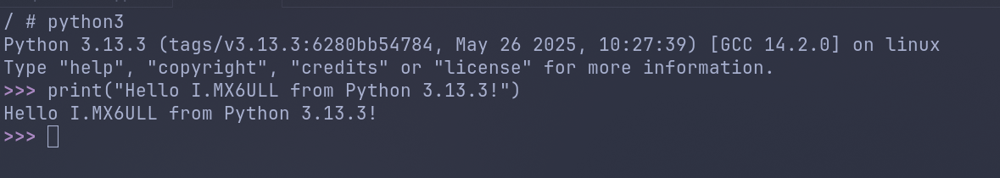
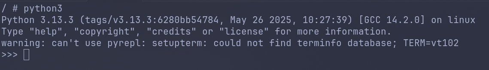

`cpython`的移植相比起其他的基础库略显复杂，我们需要先编译它的前置库，再编译`cpython`，老样子，我们的工作环境如下：

- 正点原子`I,MX6ULL ALPHA`开发板
- Docker Ubuntu 25.04 上位机
- Linux 6.12.3
- zlib 1.3.1
- libffi 3.4.8
- cpython 3.13.3

## 一，什么是 cpython

在讲如何移植`cpython`之前，我们肯定需要了解它是什么，如果你对该内容已经有所了解，可以直接跳过本节。

我们都知道`Python`，作为一个解释型的编程语言，`Python`在运行时一定要有名为**解释器**的程序来解析和执行`Python`代码，`cpython`就是`Python`的官方解释器，同时，它也是`Python`名义上的标准。

除了`cpython`之外，`Python`解释器还有`pypy`、`jython`、`RustPython`、`micropython`等等，他们往往是针对不同场景和需求而设计的，比如`pypy`是针对性能优化的，`jython`是针对`Java`环境的，`micropython`是针对微控制器环境的。

## 二，移植 zlib 和 libffi

在移植`cpython`之前，我们需要先移植它的前置库，也就是`zlib`和`libffi`。

`zlib`相对较好移植，我们先下载它的源码：

```bash
git clone https://github.com/madler/zlib.git
cd zlib
git checkout -b release_1_3_1 v1.3.1
```

注意，`zlib`已经支持了`cmake`构建，因此我们采用`cmake`构建：

```bash
cmake -S . -B build \
  -D CMAKE_BUILD_TYPE=Release -D CMAKE_C_COMPILER=arm-linux-gnueabihf-gcc \
  -DINSTALL_BIN_DIR=/tmp/zlib_build/bin \
  -DINSTALL_LIB_DIR=/tmp/zlib_build/lib \
  -DINSTALL_MAN_DIR=/tmp/zlib_build/share/man/ \
  -DINSTALL_PKGCONFIG_DIR=/tmp/zlib_build/lib/pkgconfig \
  -DINSTALL_INC_DIR=/tmp/zlib_build/include
```

我们指定构建Release版本，编译器为`arm-linux-gnueabihf-gcc`，并指定安装路径，实际编译时，请将路径指向你的安装目录。

如果没有出现错误，我们就可以开始编译和安装：

```bash
cmake --build build
cmake --install build
```

`libffi`略显复杂，因为在这个版本中，它有相当严重的构建bug，为了尽可能规避该问题，我们需要下载其`release`中的源码并解压：

```bash
wget https://github.com/libffi/libffi/releases/download/v3.4.8/libffi-3.4.8.tar.gz
tar -xvf libffi-3.4.8.tar.gz
```

接着，克隆源码：

```bash
git clone https://github.com/libffi/libffi.git
cd libffi
git checkout -b release_3_4_8 v3.4.8
```

进入源码目录，先进行`autogen`（确保`libtool`、`autoconf`、`automake`和`m4`已安装）：

```bash
./autogen.sh
```

接下来，最重要的，我们要把提前下载的源码中的`Makefile.in`复制到`libffi`目录下：

```bash
cp ../libffi-3.4.8/Makefile.in .
```

> 为什么？因为`libffi`不兼容新的`autoconf`，导致其生成了错误的`Makefile.in`，详情请参考[Issue#853](https://github.com/libffi/libffi/issues/853)

然后，我们再运行`configure`：

```bash
./configure --host=arm-linux-gnueabihf --prefix=/tmp/libffi_build
```

同样，`--prefix`指向你的安装目录。

编译并安装：

```bash
make -j
make install
```

## 三，移植 cpython

我们下载`cpython`的源码：

```bash
git clone https://github.com/python/cpython
cd cpython
git checkout -b release_3_13_3 v3.13.3
```

`cpython`使用`configure`，我们直接进行配置：

```bash
CFLAGS="-I/tmp/zlib_build/include -I/tmp/libffi_build/include -L/tmp/zlib_build/lib -L/tmp/libffi_build/lib" LDFLAGS="-L/tmp/zlib_build/lib -L/tmp/libffi_build/lib" ./configure \
  --host=arm-linux-gnueabihf --build=x86_64-linux-gnu \
  --prefix=/tmp/cpython_build --with-build-python --enable-shared \
  --enable-ipv6 ac_cv_file__dev_ptmx=0 ac_cv_file__dev_ptc=0 \
  --enable-optimizations --disable-test-modules --with-ensurepip=no
```

关于`CFLAGS`和`LDFLAGS`我们需要做的实际上只是把刚刚构建的依赖传送给编译器，所以这里的路径要替换成你自己的，同样，`--prefix`指向你自己的安装路径。

`--build`参数实际是构建机器的架构（上位机），这里笔者不确定这种写法是否正确，但是可以正常编译。

`ac_cv_file__dev_ptmx=0 ac_cv_file__dev_ptc=0`表示不检查`/dev/ptmx`和`/dev/ptc`文件，因为我们的上位机很有可能没有这两个文件，会导致编译失败。

最后，我们禁用了`test`模块和`pip`，因为我们不需要它。

编译并安装：

```bash
make -j
make install
```

## 四，验证

将所有文件拷贝到根文件系统上，上电测试：



如果你没有编译`bash`，那么你的解释器可能会报错，不过不影响基础功能：



这是因为缺少`terminfo`，如果你编译了`bash`，可以在`/etc/profile`中添加如下内容：

```bash
export TERMINFO=/usr/lib/terminfo
```

笔者的`terminfo`位于此处，读者可以根据实际情况修改。

## 五，总结

笔者的构建流程通过`Makefile`的方式托管在[imx6ull-dev](https://github.com/Dessera/imx6ull-dev)仓库，包括构建环境的`Dockerfile`和所有的构建脚本，仅供参考。
