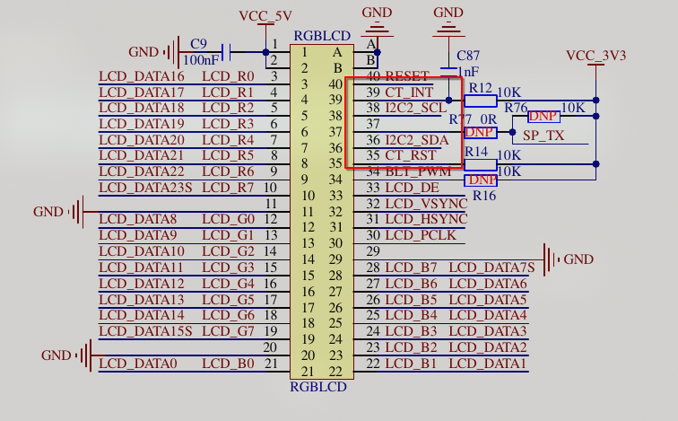
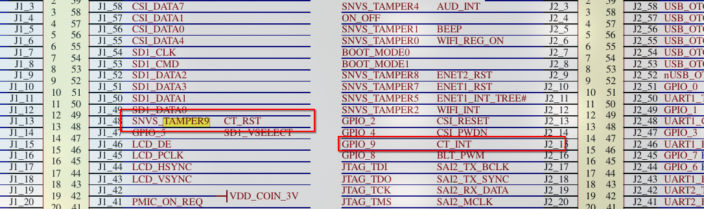
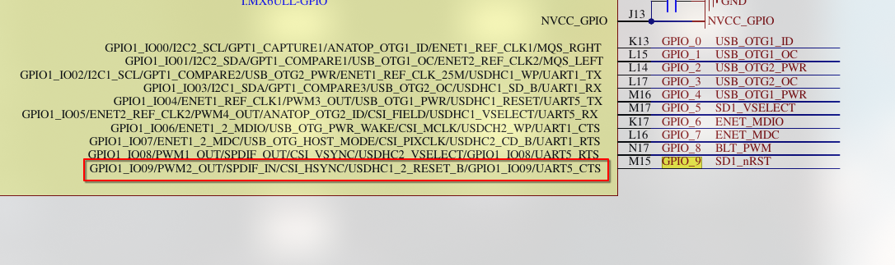
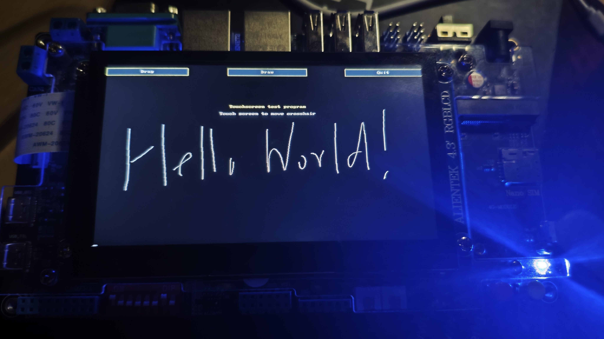

笔者上个月购买了一块正点原子的`I.MX6ULL`开发板，并且研究了一套自己的移植方案，今天来分享一下其中对于触摸屏的移植过程。

触摸屏是正点原子的`800x480`分辨率触摸屏，使用`I2C`接口，显示芯片是`GT1158`，环境如下：

- 正点原子`I,MX6ULL ALPHA`开发板
- Docker Ubuntu 25.04 上位机
- Linux 6.12.3
- tslib 1.23

> 过去正点原子的触摸屏使用的芯片是GT9147，但后来改换成了GT115X，笔者在论坛中查询得到的结果是GT1151，但实测笔者自己的开发板使用的是GT1158。
>
> 不论如何，他们的驱动都是共通的，无需为此担心。

## 一，设备树

要添加触摸屏的支持，我们首先需要了解触摸屏在开发板上的接线，通过查阅正点原子的**开发板原理图（底板）**，我们可以得到触摸屏的接线：



我们从正点的手册里知道`CT_INT`和`CT_RST`分别是触摸屏的中断和复位引脚，继续寻找他们的源头：



发现他们分别是`SNVS_TAMPER9`和`GPIO_9`，前往核心板原理图，找到`GPIO_9`：



至此，我们总结出：

- 中断引脚：`GPIO1_IO09`
- 复位引脚：`SNVS_TAMPER9`

同时我们注意到，中断引脚实际上是SD卡模块的复位引脚，我们需要移除它，否则会导致冲突。

接下来，我们新增设备树节点，参考[Goodix-TS](https://www.kernel.org/doc/Documentation/devicetree/bindings/input/touchscreen/goodix.yaml)，我们先建立`AVDD28`和`VDDIO`的`regulator`节点。：

```c
/ {
  reg_vddio: regulator-vddio {
    compatible = "regulator-fixed";
    regulator-name = "VDDIO";
    regulator-min-microvolt = <3300000>;
    regulator-max-microvolt = <3300000>;
    regulator-enable-high = <1>;
  };

  reg_avdd28: regulator-avdd28 {
    compatible = "regulator-fixed";
    regulator-name = "AVDD28";
    regulator-min-microvolt = <2800000>;
    regulator-max-microvolt = <2800000>;
    regulator-enable-high = <1>;
  };
};
```

实际上，触摸屏`tsc`在设备树中已经存在，但正点原子的开发板中没有使用到它（同时，如果你玩LED的话，它还会和LED冲突），因此我们干脆禁用了原本的`tsc`，并直接挪用了它的`pinctrl`名字：

```c
&iomuxc {
  pinctrl_tsc: tscgrp {
    fsl,pins = <
      MX6UL_PAD_GPIO1_IO09__GPIO1_IO09    0x79
      MX6UL_PAD_SNVS_TAMPER9__GPIO5_IO09  0x10B0
    >;
  };
};

&tsc {
  status = "disabled";
};

```

最后，我们添加触摸屏节点：

```c
&i2c2 {
  touchscreen@14 {
    compatible = "goodix,gt1158";
    reg = <0x14>;
    pinctrl-names = "default";
    pinctrl-0 = <&pinctrl_tsc>;
    interrupt-parent = <&gpio1>;
    interrupts = <9 0>;
    irq-gpios = <&gpio1 9 GPIO_ACTIVE_LOW>;
    reset-gpios = <&gpio5 9 GPIO_ACTIVE_LOW>;
    status = "okay";
    VDDIO-supply = <&reg_vddio>;
    AVDD28-supply = <&reg_avdd28>;
  };
};
```

这里涉及到I2C的地址，我们需要启动开发板，通过`i2cdetect`命令来检测：

```bash
~ # i2cdetect -y 1
     0  1  2  3  4  5  6  7  8  9  a  b  c  d  e  f
00:          -- -- -- -- -- -- -- -- -- -- -- -- -- 
10: -- -- -- -- UU -- -- -- -- -- -- -- -- -- -- -- 
20: -- -- -- -- -- -- -- -- -- -- -- -- -- -- -- -- 
30: -- -- -- -- -- -- -- -- -- -- -- -- -- -- -- -- 
40: -- -- -- -- -- -- -- -- -- -- -- -- -- -- -- -- 
50: -- -- -- -- -- -- -- -- -- -- -- -- -- -- -- -- 
60: -- -- -- -- -- -- -- -- -- -- -- -- -- -- -- -- 
70: -- -- -- -- -- -- -- --
```

根据检测到的地址，我们要修改`touchscreen`后面的地址和节点内的`reg`属性。

现在我们来处理冲突问题，我们查找设备树，发现`lcdif`的`pinctrl`使用了`SNVS_TAMPER9`，`usdhc1`的`pinctrl`和它的`reg_sd1_vmmc`使用了`GPIO1_IO09`，我们分别修改他们：

```c
&iomuxc {
  pinctrl_lcdif_ctrl: lcdifctrlgrp {
    fsl,pins = <
      MX6UL_PAD_LCD_CLK__LCDIF_CLK        0x79
      MX6UL_PAD_LCD_ENABLE__LCDIF_ENABLE  0x79
      MX6UL_PAD_LCD_HSYNC__LCDIF_HSYNC    0x79
      MX6UL_PAD_LCD_VSYNC__LCDIF_VSYNC    0x79
      // 移除 SNVS_TAMPER9
    >;
  };

  pinctrl_usdhc1: usdhc1grp {
    fsl,pins = <
      MX6UL_PAD_SD1_CMD__USDHC1_CMD         0x17059
      MX6UL_PAD_SD1_CLK__USDHC1_CLK         0x10071
      MX6UL_PAD_SD1_DATA0__USDHC1_DATA0     0x17059
      MX6UL_PAD_SD1_DATA1__USDHC1_DATA1     0x17059
      MX6UL_PAD_SD1_DATA2__USDHC1_DATA2     0x17059
      MX6UL_PAD_SD1_DATA3__USDHC1_DATA3     0x17059
      MX6UL_PAD_UART1_RTS_B__GPIO1_IO19     0x17059
      MX6UL_PAD_GPIO1_IO05__USDHC1_VSELECT  0x17059
      // 移除 GPIO1_IO09
    >;
  };
};

&reg_sd1_vmmc {
  /delete-property/ gpio;
};
```

这里的修改具有一定的争议，因为笔者尚不清楚`regulator`的硬件工作原理，所以，它只是能够正确工作。

同时，笔者强烈建议不要在原有设备树文件上修改，请创建一个新的`dts`文件，并引入`imx6ull-14x14-evk-emmc.dts`，尽可能做到不污染原有设备树。

现在，重新编译设备树并上传，重启开发板，如果一切顺利，我们可以通过`dmesg`观察到如下输出：

```bash
~ # dmesg | grep Goodix
[    2.607563] Goodix-TS 1-0014: ID 1158, version: 0100
[    2.615033] input: Goodix Capacitive TouchScreen as /devices/platform/soc/2100000.bus/21a4000.i2c/i2c-1/1-0014/input/input1
```

不需要自己编写驱动，内核已经内置了GT115X的驱动！

我们可以观察`/dev/input/eventX`的输出来初步观察触摸屏是否正常工作，`X`取决于你的设备实际上挂载到了哪里，这里，笔者的设备挂载到了`/dev/input/event1`，我们使用`hexdump`命令来观察：

```bash
~ # hexdump /dev/input/event1 
0000000 008c 0000 8281 0004 0003 0039 0000 0000
0000010 008c 0000 8281 0004 0003 0035 01e9 0000
0000020 008c 0000 8281 0004 0003 0036 013b 0000
0000030 008c 0000 8281 0004 0003 0030 0039 0000
0000040 008c 0000 8281 0004 0003 0032 0039 0000
0000050 008c 0000 8281 0004 0001 014a 0001 0000
0000060 008c 0000 8281 0004 0003 0000 01e9 0000
0000070 008c 0000 8281 0004 0003 0001 013b 0000
0000080 008c 0000 8281 0004 0000 0000 0000 0000
0000090 008c 0000 f600 0004 0003 0030 0033 0000
00000a0 008c 0000 f600 0004 0003 0032 0033 0000
00000b0 008c 0000 f600 0004 0000 0000 0000 0000
00000c0 008c 0000 384f 0005 0003 0039 ffff ffff
00000d0 008c 0000 384f 0005 0001 014a 0000 0000
00000e0 008c 0000 384f 0005 0000 0000 0000 0000
```

触摸一下屏幕，如果你能观察到类似的输出，那么恭喜你，触摸屏的工作基本是正常的！

## 二，软件库移植

我们下载`tslib`的源码，签出一个分支（或者你可以直接下载release中的源代码）：

```bash
git clone https://github.com/libts/tslib.git  # 克隆仓库
cd tslib                                      # 进入
git checkout release_1_23 1.23                # 签出tag 1.23作为一个分支
```

进入我们刚刚准备好的`release_1_23`，准备进行编译，注意它使用`autoconf`，一般情况下你需要以下依赖：

```bash
apt install autoconf automake libtool m4
```

在项目根目录进行`autogen`：

```bash
./autogen.sh
```

然后`configure`，`--prefix`需要更改为实际的安装路径：

```bash
./configure --prefix=/tmp/tslib_build --host=arm-linux-gnueabihf --enable-shared --enable-static
```

最后编译并安装：

```bash
make -j16
make install
```

关于如何拷贝它到开发板上，笔者不再赘述，需要注意的是，`tslib`在安装时会自动拷贝一份`ts.conf`到安装目录的`etc/ts.conf`，但比较奇怪的是`include`的安装位置和他们是同级的，这点需要手动调整（或者直接删除，为了节省空间）。

向根文件系统的`/etc/profile`中写入如下内容：

```bash
export TSLIB_CONSOLEDEVICE=none
export TSLIB_FBDEVICE=/dev/fb0
export TSLIB_TSDEVICE=/dev/input/event1
export TSLIB_CALIBFILE=/etc/pointercal
export TSLIB_CONFFILE=/etc/ts.conf
export TSLIB_PLUGINDIR=/usr/lib/ts
```

同样，`TSLIB_TSDEVICE`要指定你自己的设备。

## 三，上电测试

进入开发板，使用`tslib`自带的测试程序`ts_test`测试，如果能够正常触控，恭喜你，触摸屏移植成功！

笔者的测试效果：



## 四，总结

这是一篇部署性质的文章，至于触摸屏的原理和驱动，笔者会用单独的文章进行讲解。

之后会进行`Goodix-TS`触摸屏驱动的分析。
