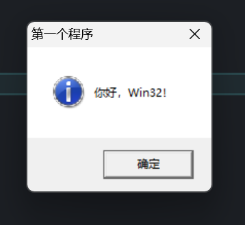

# Win32笔记01-第一个程序

笔者最近在学习 Windows，想着从最基础的 Win32 API 入手，逐步了解 Win32 API 的用法和设计逻辑。本篇文章我们从第一个 Hello World 程序入手，讨论 Win32 程序的入口、编码与 `MessageBox` 背后的宏展开。

> 本文环境：Windows 11，`gcc` 14.2.0（`mingw-w64`）。

## 编译与链接

一个使用 Win32 API 编写的 Hello World 程序如下：

```c
#include <windows.h>

int WINAPI
wWinMain(HINSTANCE hInstance,
         HINSTANCE hPrevInstance,
         PWSTR pCmdLine,
         int nCmdShow)
{
    MessageBox(NULL,
               TEXT("你好，Win32！"),
               TEXT("第一个程序"),
               MB_OK | MB_ICONINFORMATION);

    return 0;
}
```

如果想要编译这个程序，我们可以使用 `mingw-w64` 工具链，它提供完整的 Win32 API。常见的链接选项如下：

| 选项 | 作用 |
| --- | --- |
| `-luser32` | 链接 `user32.dll`（用户界面相关，窗口、消息框等） |
| `-lgdi32` | 链接 `gdi32.dll`（图形设备接口，绘图） |
| `-lcomdlg32` | 链接 `comdlg32.dll`（通用对话框） |
| `-lcomctl32` | 链接 `comctl32.dll`（通用控件） |
| `-lshell32` | 链接 `shell32.dll`（shell 相关） |
| `-ladvapi32` | 链接 `advapi32.dll`（高级 API，注册表、安全等） |
| `-lws2_32` | 链接 `ws2_32.dll`（Winsock 2，网络） |
| `-lole32` | 链接 `ole32.dll`（OLE/COM） |
| `-loleaut32` | 链接 `oleaut32.dll`（OLE 自动化） |
| `-municode` | 使用 Unicode 字符集（定义 `UNICODE` 和 `_UNICODE`，使 `wWinMain` 生效） |
| `-mwindows` | 标记为 Windows GUI 子系统（不弹出控制台窗口） |

> `gcc` 默认链接了部分 Windows 动态库，但并非全部，所以在使用相关符号之前，我们可能需要手动链接。

对于一个消息盒子程序，实际上只需要 `-luser32 -municode -mwindows`。并且，`gcc` 实际上默认链接了 `user32`，所以参数可以简化为 `-municode -mwindows`。

编译并运行该文件，我们可以获得如下窗口：



## WinMain 还是 wWinMain

在有些教程中，我们可能会看到 `WinMain`这个入口函数，我们用的却是 `wWinMain`，这是因为我们在编译时添加了 `-municode` 参数，该参数指定程序使用 `UNICODE`。那么，为什么会有两套入口？这要从 Windows 的编码历史说起。

简单来说，早期的 Windows 内部使用 ANSI 编码，但进入 Windows NT 时代之后，系统内部使用 UTF-16。为了兼容性考虑而不得不搞两套 API，而我们使用的 `MessageBox` 也实际上不是函数，而是在内部区分是否为 `UNICODE` 而重定向为 `MessageBoxW`（`UNICODE`）和 `MessageBoxA`（ANSI）。

和 ANSI 不同的是，`UNICODE` 程序支持更多的语言，ANSI 受到代码页的限制，只能支持当前系统支持的语言。

**入口函数的选择由编码决定**，如果选择支持 `UNICODE`，则使用 `crt2u.o` 作为 CRT（C Runtime）启动对象，其调用 `wWinMain`，反之则使用 `crt2.o`，走 `WinMain`。

> 代码页定义了字节转换为字符的映射，对于同一个字节，在不同的代码页中会转换为不同的字符。ANSI 兼容 API 实际上就是按照代码页将字节转换为 UTF-16，再调用对应 API 的 `UNICODE` 版本。

## 主函数参数

我们可能熟悉标准 C 语言的主函数入口，它一般有两到三个参数（`int argc, char *argv[], char *envp[]`）分别表示参数个数、参数表和环境变量表。

而 Windows 传过来的东西有点让人摸不着头脑，一共四个参数：

```c
HINSTANCE hInstance,
HINSTANCE hPrevInstance,
PWSTR pCmdLine,
int nCmdShow
```

通过跳转引用可知：`HINSTANCE` 实际上是 `struct HINSTANCE__*`，一般被叫做实例句柄，用来唯一标识一个程序。其本质上是程序模块加载到内存的基地址，用于区分不同实例的资源所属。因此，不难理解 `hInstance` 就是当前程序的句柄。

那么 `hPrevInstance` 呢，难道是上一个程序的句柄？

实际上，在 Win16 的时代，多个实例共享一个代码段，`hPrevInstance` 就用来检测是否有另一个实例在运行，如果有另一个实例正在运行，当前实例就可以复用它的资源。该参数在 Win32 的时代**已经被废弃了，恒为 `NULL`**。

第三个参数 `pCmdLine` 表示当前程序的命令行，其类型为 `PWSTR`（`WCHAR*`，即 `wchar_t*` 16 位宽字符串）。对于 ANSI 程序来说，这里传入的是 `PSTR`（`CHAR*`，指向普通窄字符串的指针）。

最后一个参数是 `nCmdShow`，它用来指明程序最初如何显示（正常、最大化、最小化等）。该值不通过程序或者用户手动设置，而是由系统根据启动方式自动传入，我们这里用不到。

读者可能还注意到了，代码中使用 `WINAPI` 来修饰主函数，这其实是 Windows 调用约定的辅助宏，展开为 `__stdcall`。

> 在 64 位 Windows 上，`__stdcall` 会被忽略，这是因为 x64 只有一种调用约定，但宏依然保留，保证源码兼容。

## MessageBox 详解

回到主函数内部，我们已经知道了 **`MessageBox` 实际上是一个宏**，它的参数中使用的 `TEXT` 同样是宏，它根据使用编码的不同展开为普通窄字符串（ANSI）和宽字符串（`UNICODE`）。

消息盒子的四个参数分别是：窗口句柄（指示消息盒子的父窗口）、消息框中的文本、消息框标题和显示的按钮和图标。按钮和图标由 `MB_*` 系列宏指定，所有的按钮定义如下：

```c
#define MB_OK               __MSABI_LONG(0x00000000)
#define MB_OKCANCEL         __MSABI_LONG(0x00000001)
#define MB_ABORTRETRYIGNORE __MSABI_LONG(0x00000002)
#define MB_YESNOCANCEL      __MSABI_LONG(0x00000003)
#define MB_YESNO            __MSABI_LONG(0x00000004)
#define MB_RETRYCANCEL      __MSABI_LONG(0x00000005)
```

还可以使用下面的宏来指定默认按钮：

```c
#define MB_DEFBUTTON1 __MSABI_LONG(0x00000000)
#define MB_DEFBUTTON2 __MSABI_LONG(0x00000100)
#define MB_DEFBUTTON3 __MSABI_LONG(0x00000200)
#define MB_DEFBUTTON4 __MSABI_LONG(0x00000300)
```

可以用下列宏来指定消息框显示的图标：

```c
#define MB_ICONHAND        __MSABI_LONG(0x00000010)
#define MB_ICONQUESTION    __MSABI_LONG(0x00000020)
#define MB_ICONEXCLAMATION __MSABI_LONG(0x00000030)
#define MB_ICONASTERISK    __MSABI_LONG(0x00000040)
#define MB_USERICON        __MSABI_LONG(0x00000080)
#define MB_ICONWARNING     MB_ICONEXCLAMATION
#define MB_ICONERROR       MB_ICONHAND
#define MB_ICONINFORMATION MB_ICONASTERISK
#define MB_ICONSTOP        MB_ICONHAND
```

## 小结

我们从一个简单的 Win32 程序梳理了 Win32 的基础知识点和代码风格，之后我们会继续深入，看看 Win32 的窗口类与消息循环是如何工作的。
