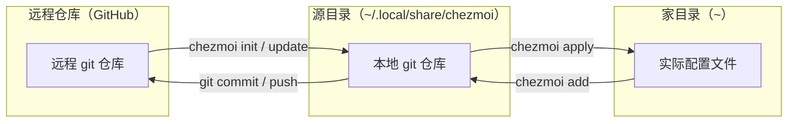

# 工具推荐：使用Chezmoi同步不同机器之间的配置文件

## 前言

笔者最近在配置自己的 Agent 工具，我有很多台机器和虚拟环境，手动在不同环境之间同步配置不免令人烦恼。

面对这个问题，笔者过去曾用过两种方案，但都不太满意：

1. 使用 `nixos` 的时候：完全没有这种问题，配置文件在每台机器上都是完全统一的，但是 `nixos` 和主流系统，甚至是主流 `linux` 系统相比都显得不太合群（不兼容），因此最终放弃了使用，转而使用 Windows + WSL2；
2. 使用一个 `git` 仓库：适合托管单一软件的配置，如果涉及到多目录、多个软件的配置，使用就显得有些局促。

经过一番查找，笔者找到了这个工具——Chezmoi。这篇文章从 Chezmoi 的同步原理入手，带着读者完整跑通一次“多机同步配置文件”的流程。

> 本文环境：Windows，chezmoi 通过 `winget` 安装，命令示例以 PowerShell 运行为准。

## 原理

实际上 Chezmoi 也是组织了一个 git 仓库来存储你的所有 dotfile（即各种软件的配置文件）。一般我们习惯在家目录（`~`）原地初始化 git，但 Chezmoi 没有这么做，它另选了一个目录作为 git 仓库的所在地，这个目录被称为**源目录（source directory）**，默认位于 `~/.local/share/chezmoi`。

> 在 Windows 上，源目录默认位于 `%LOCALAPPDATA%\chezmoi`。

相应地，我们把家目录里真正生效的配置文件称为**目标目录（target directory）**。Chezmoi 的工作方式，就是在源目录和目标目录之间做双向映射：

- 家目录 → 源目录：`chezmoi add`，把想纳入管理的配置文件拷入源目录；
- 源目录 → 家目录：`chezmoi apply`，把源目录里的内容分发回家目录。

不同机器之间只通过 git 同步源目录，再由每台机器把源目录分发到实际配置文件上。这样做的第一个好处，是我们**只挑选想要的文件夹进入仓库**，相当于一种“外部的 `gitignore`”。

为什么说它反转了 `gitignore` 的特性？对于同步家目录下的配置文件，我们要考虑的往往是“同步什么”而不是“排除什么”：`gitignore` 默认是“除了排除的都要”，而 Chezmoi 是“只有 `add` 过的才要”，后者更贴合使用场景。

原理图如下（复刻自 chezmoi 官网）：



> 图中省略了 `chezmoi edit`、`chezmoi diff`、`chezmoi status` 等日常命令，它们都作用于源目录与家目录之间，本质与上图一致。

## 安装与初始化

Windows 可以直接通过 `winget` 下载安装：

```powershell
winget install twpayne.chezmoi
```

安装好 Chezmoi 后，我们需要在远程（比如 GitHub）创建一个空仓库，用来承载配置文件。然后在本地执行下面的命令，把源目录和远程仓库关联起来：

```powershell
chezmoi init https://github.com/<用户名>/<仓库名>.git
```

> `--apply` 参数可以省略。它是在另一台需要同步配置的机器上初始化时使用的：加上该参数，会在克隆远程仓库后立刻把配置应用到家目录，一步到位。

`chezmoi init` 会在源目录（`~/.local/share/chezmoi`）里初始化一个 git 仓库，并把远程仓库添加为 `origin`。和我们平时把配置文件直接丢进一个 `git clone` 出来的目录不同，Chezmoi 把“仓库”和“配置生效的位置”分开了。

## 基本使用

初始化完成后，接下来把想要纳入管理的文件、文件夹添加到 Chezmoi 中：

```powershell
chezmoi add ~/.agents                 # 添加文件夹
chezmoi add ~/.config/starship.toml   # 添加文件
```

`chezmoi add` 会把指定的文件/文件夹拷贝到本地源目录，但不会自动执行 `git add`、`git commit`——这一步只负责选定“同步什么”。

准备好所有文件后，调用 `chezmoi cd` 进入源目录，在熟悉的 git 环境里提交刚才的改动：

```bash
git add --all
git commit -m "chore: add some files"
git push -u origin main   # 提交到远程
```

在另一台机器上需要同步时，先装好 Chezmoi，然后：

```powershell
# 新机器：克隆远程仓库并立刻应用
chezmoi init --apply https://github.com/<用户名>/<仓库名>.git
```

如果这台机器之前已经初始化完毕，则直接拉取更新：

```powershell
chezmoi update
```

> `chezmoi update` 等价于 `git pull` + `chezmoi apply`：先从远程拉取最新的源目录，再分发到家目录。

## 更新远程配置

当本地某个配置文件的内容发生改动后，想把改动同步到远程，需要先使用 `chezmoi re-add`：

```powershell
chezmoi re-add ~/.config/starship.toml
```

`chezmoi re-add` 和 `chezmoi add` 几乎相同，区别在于它能将已经纳管的文件的本地改动，更新到源目录中。然后走和之前一样的 `chezmoi cd` 流程提交即可：

```bash
chezmoi cd
git add --all
git commit -m "chore: update starship config"
git push
```

> 如果你平时用 `chezmoi edit` 编辑文件，改动会直接落在源目录里，就不需要 `re-add` 这一步；`re-add` 主要针对直接修改了家目录里生效配置的场景。

## 高级用法：加密敏感文件

配置文件难免会涉及私密的 token、密钥，比如 `~/.ssh/id_rsa`。Chezmoi 支持对源目录中的文件进行加密，这里以 `age` 加密为例。`age` 是一个简单、现代的加密工具，`chezmoi` 内置了对它的支持。

先生成密钥对：

```powershell
chezmoi age-keygen --output=$HOME/key.txt
```

然后在 chezmoi 配置文件（`~/.config/chezmoi/chezmoi.toml`）中声明加密方式和密钥：

```toml
encryption = "age"

[age]
    identity = "C:/Users/<用户名>/key.txt"
    recipient = "age1ql3z7hjy54p..."
```

> `identity` 是你的私钥，用于解密；`recipient` 是你的公钥，用于加密。Chezmoi 支持配置多个密钥对，更高级的 age 用法这里不做赘述。

对想加密的文件，`add` 时加上 `--encrypt`：

```powershell
chezmoi add --encrypt ~/.ssh/id_rsa
```

这样 `id_rsa` 就以密文形式进入源目录，可以放心推到远程仓库。当你用 `chezmoi edit` 编辑该文件时，Chezmoi 会先解密、再加密回去，对使用者完全透明。

## 其他

Chezmoi 还有两个值得一提的能力，但笔者目前没有用上，因此不做展开：

- **模板语法**：源目录中的文件可以写成 `text/template` 模板，根据机器平台、环境变量渲染出不同内容，用于区分不同机器间的差异；
- **密码管理器联动**：可以在模板中直接引用 1Password、Bitwarden 等密码管理器中的条目，敏感信息不进 git 仓库。

有兴趣的读者可以前往官方文档了解。

## 结语

至此，我们总结出：**Chezmoi 把配置的“存储”（源目录）与“生效”（家目录）分离，通过 `add` / `apply` 双向同步，把“同步什么”的主动权交还给用户**。配合加密与模板，它足以胜任大多数人的 dotfile 管理需求。

## 参考链接

- [Chezmoi 官方文档](https://www.chezmoi.io/)
