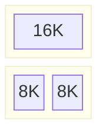
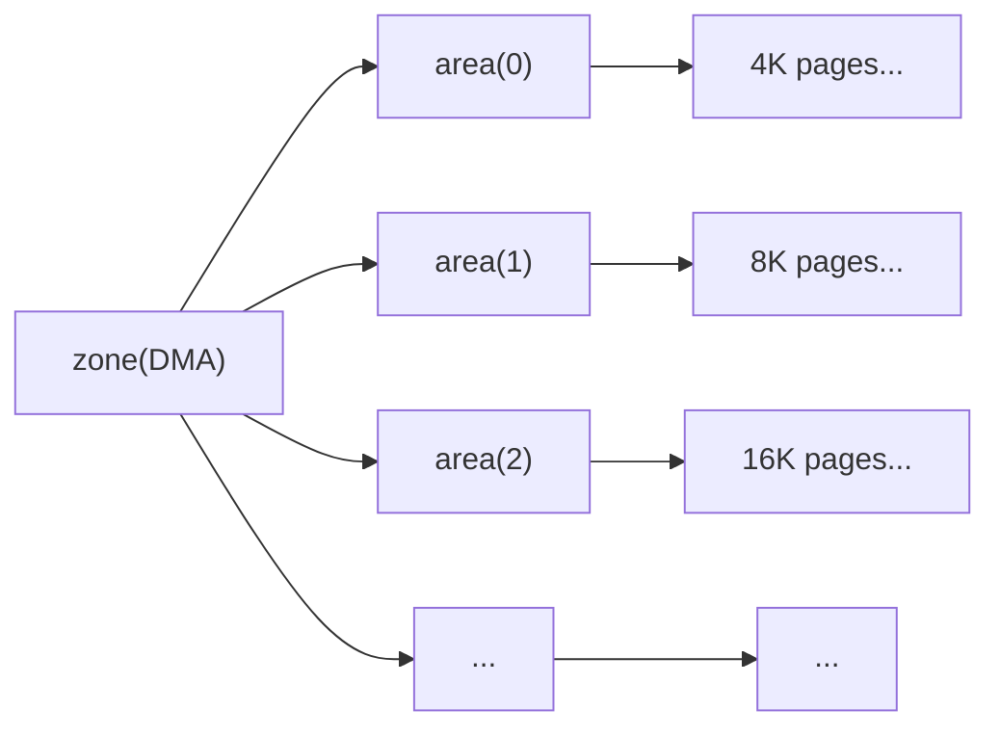

好吧，这个标题稍微有那么一点“标题党”的嫌疑，我们不可能脱离`Linux`去实现一个完整的伙伴系统（除非我们亲手实现一个`Linux`内核），但是我们可以实现一个简化版的伙伴系统，这个简化版的伙伴系统可以用于理解伙伴系统的工作原理。

我们要实现的简化版伙伴系统，运行在`i386`架构，假定系统中只有`DMA`、`NORMAL`和`HIGHMEM`三个内存域，除此之外，我们涉及到的一些伙伴系统以外的API将不会过多提及，这些API如下：

- `bootmem`相关：是伙伴系统之前的自举内存分配器
- `e820`相关：是`BIOS`提供的内存布局信息
- `page`相关：是我的玩具内核中对虚拟页表和物理页的管理模块
- `list_head`相关：是内核中常用的链表结构体

达成以上共识之后，我们可以开始我们的简化版伙伴系统的实现。

> 本文的环境是`gcc 14`，标准为`c23`

## 伙伴系统简介

伙伴系统是著名的物理内存管理方案，它将内存页重组为一块块连续的内存块（这些内存块都必须是`4KB`的 $2^n$ 倍），并将他们两两配对，形成**伙伴**，当分配内存时，伙伴系统会按照需求的内存块大小查找满足要求的内存块，如果找不到，它会查找更大的内存块并将他分裂为两个伙伴，并分配其中一块，如果还找不到，则递归进行以上操作，直到找到满足要求的内存块。

这里说的内存块的大小，我们一般将其称为内存块的阶数，例如，`4KB`的内存块称为`0`阶内存块，`8KB`的内存块称为`1`阶内存块，`16KB`的内存块称为`2`阶内存块，以此类推。

举个例子，我们在一个有两个`16KB`伙伴的系统中尝试分配一个`4KB`内存块，下面是伙伴系统内部的变化：


当我们请求一个`4KB`内存块时，伙伴系统会先查找是否有`4KB`的伙伴，显然没有，于是伙伴系统会查找是否有`8KB`的伙伴，也没有，于是伙伴系统会查找是否有`16KB`的伙伴，找到了，于是伙伴系统将`16KB`的伙伴分裂为两个`8KB`的伙伴：



然后伙伴系统将其中一个`8KB`的伙伴分配出去，并返回给用户：


当释放内存块时，伙伴系统会先查找该内存块的伙伴是否空闲，如果空闲的话，伙伴系统会将两个伙伴合并为一个更大的伙伴，并试图将这个更大的伙伴合并到更大的伙伴中，直到无法合并为止。

还是上面的例子，现在用户希望释放刚刚申请的`4KB`内存块，伙伴系统会先查找该内存块的伙伴是否空闲，显然是空闲的，于是伙伴系统将两个伙伴合并为一个更大的伙伴：


伙伴系统发现，合并后，两个伙伴可以合并为一个更大的伙伴，于是伙伴系统将两个伙伴合并为一个更大的伙伴：


当然，我们这里假设我们最大的内存块是`16KB`，所以不再进行合并。

值得注意的是，所有的伙伴内存块都必须是**物理连续**的，例如，我们其中一个`4KB`的内存块地址为`0x0000`，那么它的伙伴内存块地址就为`0x1000`，该伙伴关系是当物理页初始化时就确定的，伙伴系统不会对伙伴关系进行修改，它只会标记伙伴内存块是否空闲。

## 实现伙伴系统 - 初始化物理内存页

首先，为了标记物理内存页的状态，我们需要一组结构体来代表所有的物理内存页，我们编写如下代码：

```c
struct page
{
  // 内存阶
  u8 order;

  // 内存页类型
  enum mem_zone_type zone_type;

  // 内存页链表节点
  struct list_head node;

  // 是否被保留（被bootmem使用、被e820标记为非RAM等）
  bool reserved;

  // 是否在伙伴系统中
  bool buddy;
};
```

现实实现我们可以酌情优化一下数据结构的大小，比如将`reserved`、`buddy`和任何你想放进去的标志合并为一个`flags`，但是为了方便理解，我们这里就不做优化了。

这里的`enum mem_zone_type`是内存域类型，我们这里只实现三个内存域，他们分别是`MEM_ZONE_DMA`、`MEM_ZONE_NORMAL`和`MEM_ZONE_HIGH`。

接下来，我们初始化物理内存页：

```c
size_t mem_pages = e820_get_memory_pages_cnt();             // 获取系统中所有的物理内存页数量
__pages = bootmem_alloc((sizeof(struct page) * mem_pages)); // 分配物理内存页结构体数组
kmemset(__pages, 0, sizeof(struct page) * mem_pages);       // 将物理内存页结构体数组清零

e820_pre_init_pages(__pages, mem_pages);                    // 将e820中非`RAM`类型的内存页标记为`reserved`
bootmem_pre_init_pages(__pages, mem_pages);                 // 将bootmem已使用的内存标记为`reserved`
```

接下来，我们实现一组对物理内存页的操作函数：

```c
// 获取物理内存页的索引
size_t
page_get_index(struct page* page)
{
  return page - __pages;
}

// 获取对应索引的物理内存页
struct page*
page_get(size_t index)
{
  return &__pages[index];
}

// 获取物理内存页的物理地址
uintptr_t
page_get_phys(struct page* page)
{
  return page_get_index(page) * MEM_PAGE_SIZE;
}
```

> 这里我们可以将`__pages`导出，用宏或者`inline`实现这些函数，但是为了方便理解，我们这里就不做优化了。

接下来我们进入伙伴系统的初始化：

## 实现伙伴系统 - 初始化伙伴系统

伙伴系统是的职责之一是将内存分类，在非`NUMA`架构下，我们的数据结构划分如下：


感觉有些迷惑？我们先来介绍一下这些结构：

- `zone`：内存域，代表一块连续的内存，例如`DMA`内存域、`NORMAL`内存域和`HIGHMEM`内存域
- `area`：内存区，代表按照一定阶数划分的内存，例如，`0`阶内存区、`1`阶内存区、`2`阶内存区等
- `page`：物理内存页，代表一块物理内存

我们重新画一下数据结构图，以`DMA`为例：



好，了解了这些，我们来实现一下这些数据结构：

```c
struct mem_area
{
  // 当前内存区中空闲的内存块，使用链表组织以动态管理内存
  struct list_head mem_blocks;

  // 当前内存区中空闲的内存块数量
  size_t blocks_free;
};

struct mem_zone
{
  // 当前内存域中所有的内存区
  struct mem_area areas[MEM_BUDDY_MAX_ORDER + 1];

  // 当前内存域物理页起始
  size_t pg_start;

  // 当前内存域物理页数量
  size_t pg_cnt;

  // 当前内存域中空闲的物理页数量
  size_t pg_free;
};
```

然后，我们留下一个全局变量：

```c
struct mem_zone __zones[MEM_ZONE_SIZE]; // 内存域数组
```

我们使用到了两个宏，他们分别是`MEM_ZONE_SIZE`和`MEM_BUDDY_MAX_ORDER`，他们的定义如下：

```c
#define MEM_ZONE_SIZE 3         // 内存域数量，和内存类型枚举的数量相同
#define MEM_BUDDY_MAX_ORDER 10  // 最大内存阶，10表示最大的内存块为128KB
```

接下来，我们实现`mem_zone`的初始化：

```c
static void
__init_zone(struct mem_zone* zone,
            enum mem_zone_type type,
            size_t pg_start,
            size_t pg_end)
{
  // 将内存域清零
  zone->pg_free = 0;

  // 检查起始物理页和结束物理页是否合法，不合法则该域为空域
  if (pg_start > pg_end) {
    zone->pg_cnt = 0;
  } else {
    zone->pg_cnt = pg_end - pg_start + 1;
  }

  // 设置内存域起始物理页
  zone->pg_start = pg_start;

  // 初始化每一个内存区，将他们清空
  for (size_t i = 0; i <= MEM_BUDDY_MAX_ORDER; i++) {
    list_init(&zone->areas[i].mem_blocks);
    zone->areas[i].blocks_free = 0;
  }

  // 查找每一个内存页，标记内存页类型
  // 如果没有被保留（已使用），通过`buddy_free_page`将内存页加入伙伴系统
  for (size_t i = pg_start; i <= pg_end; i++) {
    AUTO pg = page_get(i);
    pg->zone_type = type;

    if (!pg->reserved) {
      buddy_free_page(pg, 0);
    }
  }
}
```

先说明一下参数，`pg_start`和`pg_end`分别表示内存域的起始物理页和结束物理页，`type`表示内存域类型，`zone`表示要初始化的内存域。

> 实际上我们可以通过偏移计算内存域类型，但这里为了方便，我们直接传入。
>
> 另外，我们在实现中大量使用了`AUTO`宏，它是`GNU`拓展的封装，原型为`__auto_type`，表示自动推导类型。

这里涉及到了`buddy_free_page`函数，这个函数的作用是将物理内存页加入伙伴系统，我们稍后实现。

接下来，我们实现伙伴系统的初始化：

```c
void
init_buddy(void)
{
  uintptr_t mem_size = e820_get_memory_size();  // 获取系统中所有的物理内存大小

  // init zones
  __init_zone(&__zones[MEM_ZONE_DMA],
              MEM_ZONE_DMA,
              PAGE_INDEX(MEM_TYPE_DMA_START),
              PAGE_INDEX(MEM_TYPE_NORMAL_START) - 1);

  __init_zone(&__zones[MEM_ZONE_NORMAL],
              MEM_ZONE_NORMAL,
              PAGE_INDEX(MEM_TYPE_NORMAL_START),
              PAGE_INDEX(MIN(MEM_TYPE_HIGH_START, mem_size)) - 1);

  __init_zone(&__zones[MEM_ZONE_HIGH],
              MEM_ZONE_HIGH,
              PAGE_INDEX(MEM_TYPE_HIGH_START),
              PAGE_INDEX(mem_size) - 1);
}
```

这里的`PAGE_INDEX`是一个宏，用于计算物理页的索引：

```c
#define PAGE_INDEX(addr) ((addr) / MEM_PAGE_SIZE)
```

接下来的几个宏都表示了内存类型的起始点

```c
#define MEM_TYPE_DMA_START 0x00000000
#define MEM_TYPE_NORMAL_START 0x01000000
#define MEM_TYPE_HIGH_START 0x30000000
```

## 实现伙伴系统 - 分配和释放

我们来实现核心的分配和释放操作，注意，我们并没有在实现完整的操作系统，所以我们这里的操作都是无锁的，现实中的实现可以参考`Linux`内核使用自旋锁和开关中断的方式保证访问内存页的安全。

### 分配内存块

相对分配来说，释放是一个比较简单的操作，但我们先实现分配，否则我们没有办法很好的理解释放操作：

```c
struct page*
buddy_alloc_page(enum mem_zone_type zone_type, u8 order)
{
  // 断言，保证`order`合法，你可以通过其他方式限制`order`的范围
  KASSERT(order <= MEM_BUDDY_MAX_ORDER, "order too large, received %u", order);

  // 获取对应的内存域
  AUTO zone = &__zones[zone_type];

  // 循环查找，向上查找能够分配的内存区
  size_t alloc_order = order;
  struct mem_area* area;
  while (alloc_order <= MEM_BUDDY_MAX_ORDER) {
    area = &zone->areas[alloc_order];
    if (area->blocks_free > 0) {
      break;
    }

    alloc_order++;
  }

  // 没找到，该类型内存已经分配完，返回NULL
  if (alloc_order > MEM_BUDDY_MAX_ORDER) {
    return NULL;
  }

  // 获取该内存区中的第一个内存块，检查它是否受到伙伴系统的管理
  // 实际上这里可以不做断言，但为了严谨性我们还是做了
  AUTO page = LIST_ENTRY(area->mem_blocks.next, struct page, node);
  KASSERT(page->buddy,
          "broken buddy system, page %p is not part of a block",
          page_get_phys(page));

  // 从当前内存区中删除该内存块
  __area_delete_page(area, page);

  // 递归向下分裂内存块，直到分裂到`order`阶
  // 分裂后会产生两个内存块，将后者分配给用户
  while (alloc_order > order) {
    alloc_order--;
    area = &zone->areas[alloc_order];

    __area_add_page(area, page);

    page->order = alloc_order;
    page += 1 << alloc_order;
  }

  // 相应减少内存域中空闲页的数量
  zone->pg_free -= BUDDY_ORDER_PAGES(order);

  // 检查我们拿出的内存块是否仍然受到伙伴系统的管理
  KASSERT(!page->buddy,
          "broken buddy system, allocated page %p is still part of a block",
          page_get_phys(page));
  return page;
}
```

有点迷糊？没关系，我们一点点来分析。

首先，我们通过`zone_type`找到对应的内存域后，按照最开始的对伙伴系统的描述，我们向上查找能够分配该内存的内存区：

```c
size_t alloc_order = order;
struct mem_area* area;
while (alloc_order <= MEM_BUDDY_MAX_ORDER) {
  // 获取当前内存区
  area = &zone->areas[alloc_order];

  // 如果该内存区有空闲页，找到，退出循环
  if (area->blocks_free > 0) {
    break;
  }

  // 否则，继续向上查找
  alloc_order++;
}
```

最后，我们会得到`alloc_order`，表示我们找到的能够分配的内存区阶数，和`area`，表示我们找到的内存区。

然后我们拿出这个区内的第一个内存块，等等，我们之前一直隐藏了一个问题：每阶存储的内存块的大小都是不同的，我们凭什么使用大小等于`4K`的物理内存抽象来存储它呢？

当然，我们用`order`来指定了这个页的阶数，但要记得，我们的物理页大小永远是`4K`，我们有两种方法管理在`area`中的内存块：

1. 将内存块的所有内存页都放入链表，这样绝对符合逻辑，但难以管理。
2. 只将内存块的第一个内存页放入链表，这样管理起来方便，但需要通过`order`来在不同的内存块之间跳转。

我们实际上使用了第二种方法，这样，我们的一个内存页往往有多种身份，取决于它当前的阶数：

> 下划线代表该位用于索引该内存块

| 所在容器 | 所属下标 | 所属下标 | 所属下标 | 所属下标 |
| :----: | :----: | :----: | :----: | :----: |
| 内存页 | <u>0</u> | <u>1</u> | <u>2</u> | <u>3</u> |
| 0阶 | <u>0</u> | <u>1</u> | <u>2</u> | <u>3</u> |
| 1阶 | <u>0</u> | 0 | <u>1</u> | 1 |
| 2阶 | <u>0</u> | 0 | 0 | 0 |

理解了这个，我们就可以继续了，接下来，我们先从当前内存区删除该块，这里用到了`__area_delete_page`：

```c
static void
__area_delete_page(struct mem_area* area, struct page* page)
{
  // 从链表中删除
  list_del(&page->node);

  // 减少空闲块的数量
  area->blocks_free--;

  // 脱离伙伴系统管理
  page->buddy = false;
}
```

当然，我们还有`__area_add_page`：

```c
static void
__area_add_page(struct mem_area* area, struct page* page)
{
  // 将该内存块添加到链表
  list_add(&page->node, &area->mem_blocks);

  // 增加空闲块的数量
  area->blocks_free++;

  // 加入伙伴系统管理
  page->buddy = true;
}
```

我们从`alloc_order`向下分裂内存块，直到分裂到`order`阶：

```c
// 循环直到分裂到`order`阶
while (alloc_order > order) {
  // 将`order`下移
  alloc_order--;
  // 获取当前内存区
  area = &zone->areas[alloc_order];

  // 修改内存块的阶数
  page->order = alloc_order;
  // 将该内存块添加到当前内存区
  __area_add_page(area, page);

  // 获取新的内存块索引
  page += 1 << alloc_order;
}
```

上面的我们都很好理解，为什么我们原封不动地将`page`直接插入了新的内存区呢？我们刚才讲过了，内存页的身份取决于当前阶数，并且，**更高阶数的内存块索引总是分裂后第一个低阶内存块的索引**，所以，我们直接将`page`插入新的内存区，因为它就是第一个低阶内存块。

很明显地，我们这么做实际上就是分配第二个分裂内存块给下一阶，所以最后的左移操作也好理解了，我们通过平移`page`的方式找到它的伙伴，然后递归向下分裂，直到分裂到`order`阶。

为什么左移操作能够找到对应的伙伴呢？我们举个例子：

```plaintext
0阶：0 += 1 << 0 = 1
1阶：0 += 1 << 1 = 2
2阶：0 += 1 << 2 = 4
3阶：0 += 1 << 3 = 8
```

可以看到，左移操作实际上就是将当前索引加上 $2^{order}$，正好是下一个内存块的索引，因为我们刚才使用的`page`是分裂出来的第一个内存块，这样查找到的就一定是分裂后的第二个内存块，因此二者必然是伙伴。

同时，后者一定没有被加入伙伴系统，因为它在上一阶不是索引，自然不在链表中，其`buddy`字段也一定为`false`。

最后，我们相应减少内存域中空闲页的数量，并将分配的内存块返回，这就是分配内存块的全部过程。

### 释放内存块

最后，我们来实现释放操作：

```c
void
buddy_free_page(struct page* page, u8 order)
{
  // 检查页状态
  KASSERT(order <= MEM_BUDDY_MAX_ORDER, "order too large, received %u", order);
  KASSERT(!page->reserved, "cannot free reserved page %p", page_get_phys(page));
  KASSERT(!page->buddy,
          "cannot free page %p that is part of a buddy block",
          page_get_phys(page));

  // 获取页索引，检查该索引是否按照阶数对齐
  AUTO idx = page_get_index(page);
  if (!BUDDY_ALIGN_CHECK(idx, order)) {
    KWARNING("page %p is not aligned to order %u", page_get_phys(page), order);
    return;
  }

  AUTO zone = &__zones[page->zone_type];
  zone->pg_free += BUDDY_ORDER_PAGES(order);

  // 递归合并内存块
  AUTO area = &zone->areas[order];
  while (order < MEM_BUDDY_MAX_ORDER) {
    AUTO buddy_idx = BUDDY_GET_BUDDY_INDEX(idx, order);
    AUTO buddy = page_get(buddy_idx);

    // another block is not free or another block is not of the same order
    if (!buddy->buddy || buddy->order != order) {
      break;
    }

    __area_delete_page(area, buddy);

    idx = BUDDY_GET_ASCEND_INDEX(idx, order);
    order++;
    area = &zone->areas[order];
  }

  // 获取最终合并的内存块索引
  page = page_get(idx);
  page->order = order;

  // 将内存块添加到对应的内存区
  __area_add_page(area, page);
}
```

有了分配时的理解，我们可以很轻松地理解释放内存块的过程，首先我们对参数进行一系列的检查，确保它确实可以被释放，这些检查可以被总结为：

- 阶数符合要求
- 页没有被保留
- 页不在伙伴系统中
